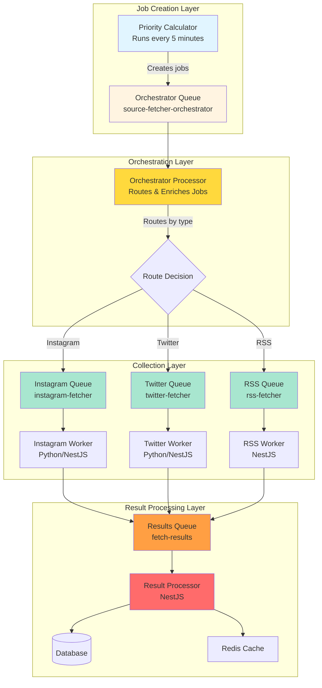
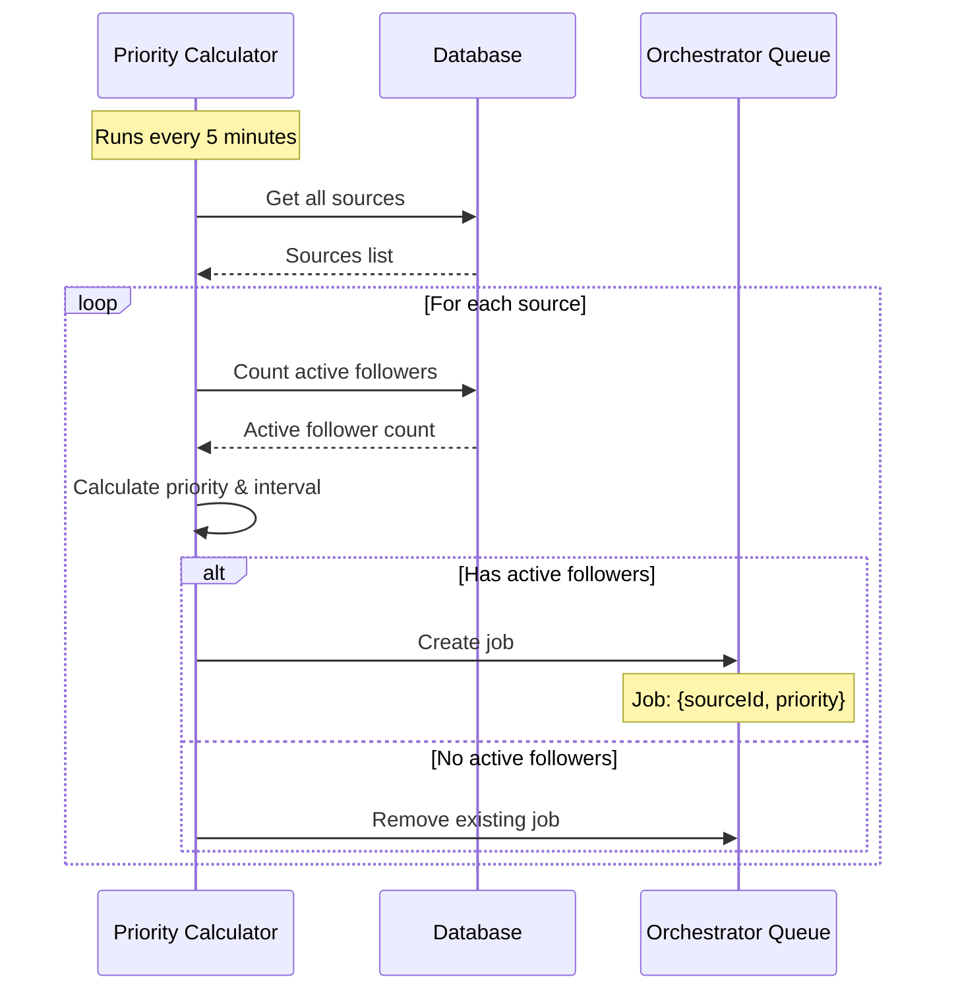
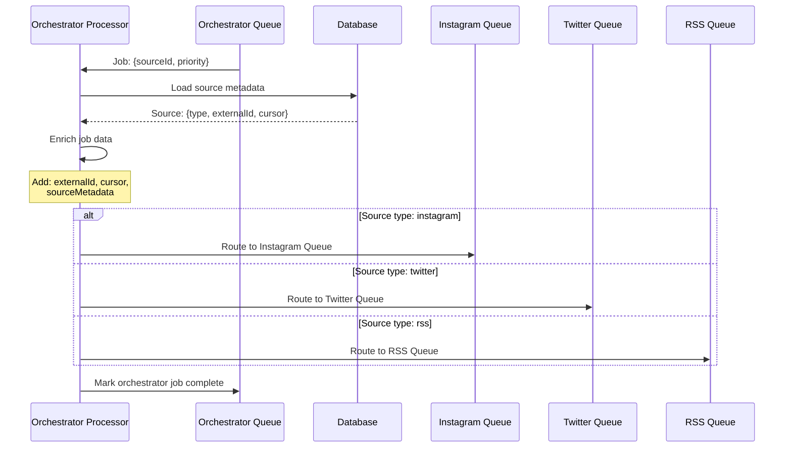
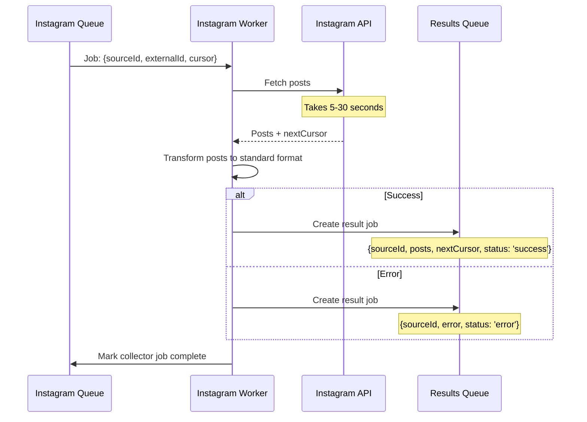
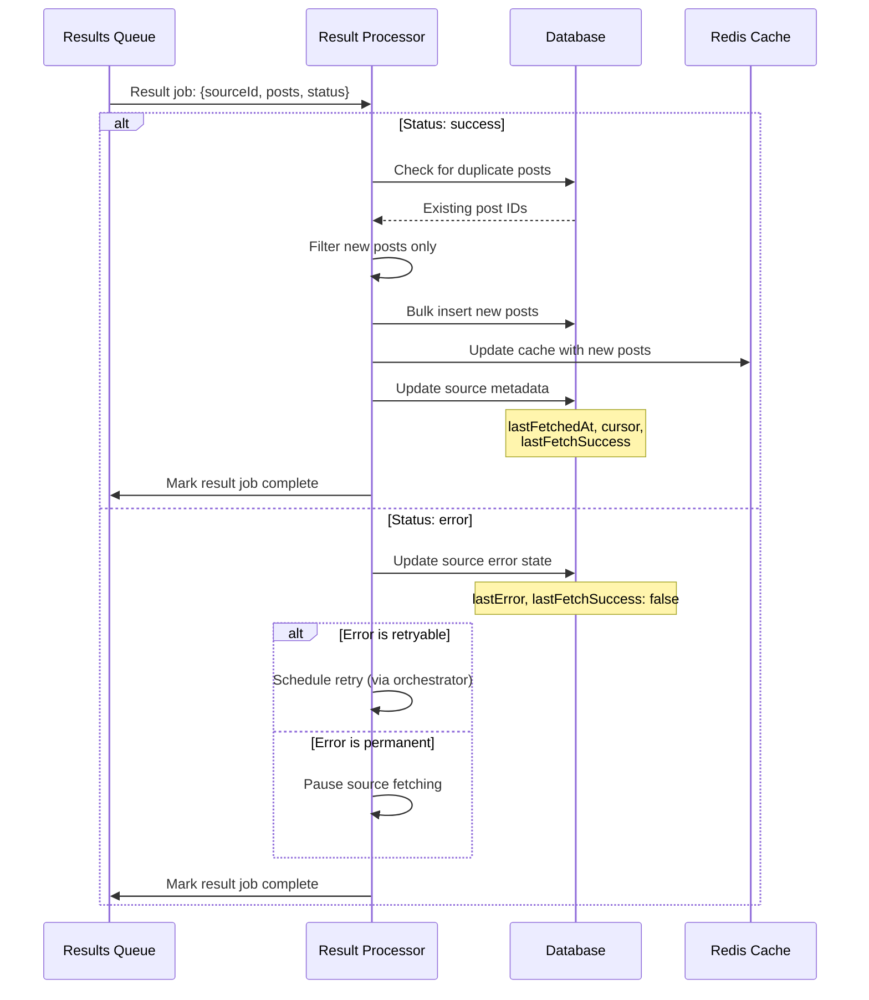
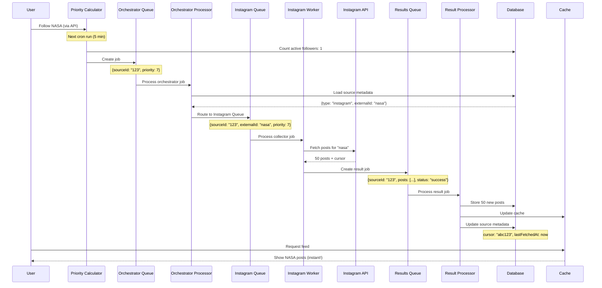
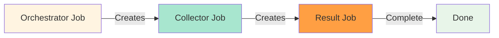
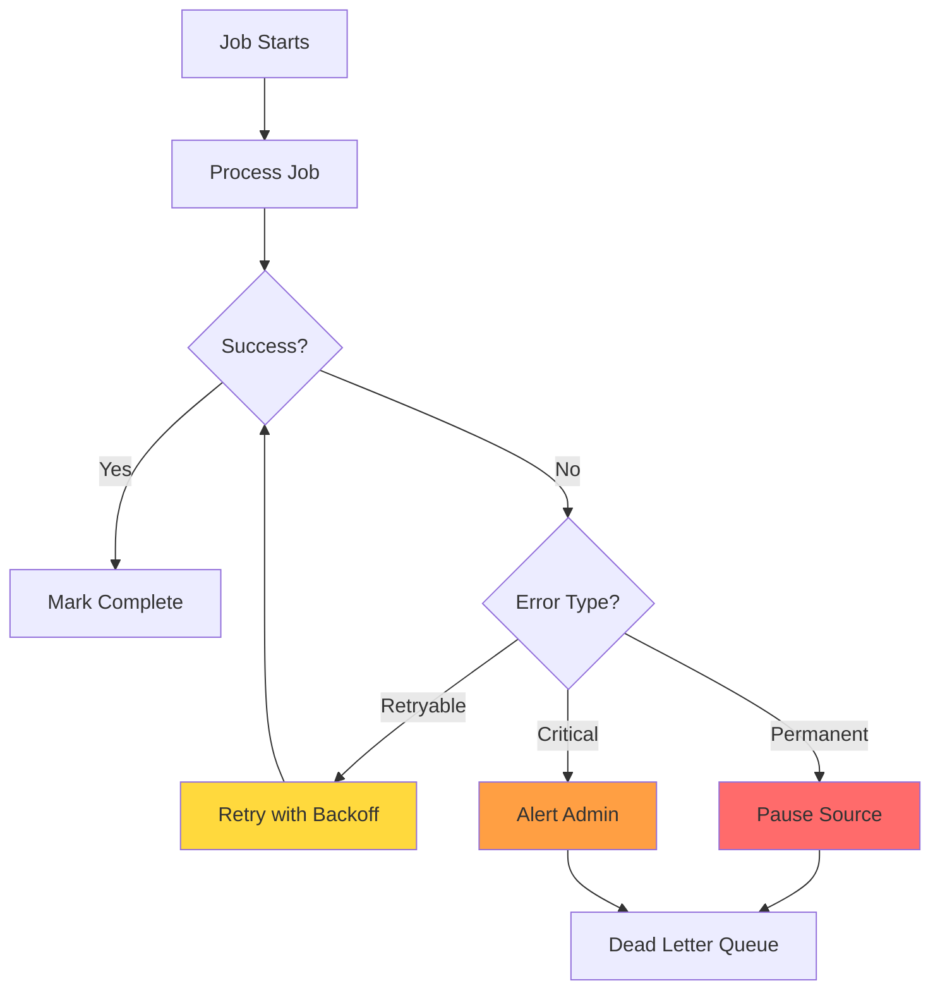
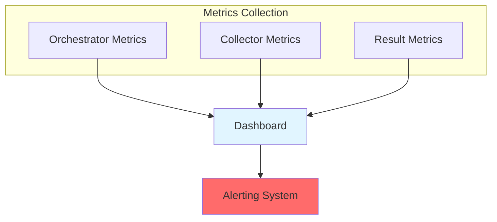
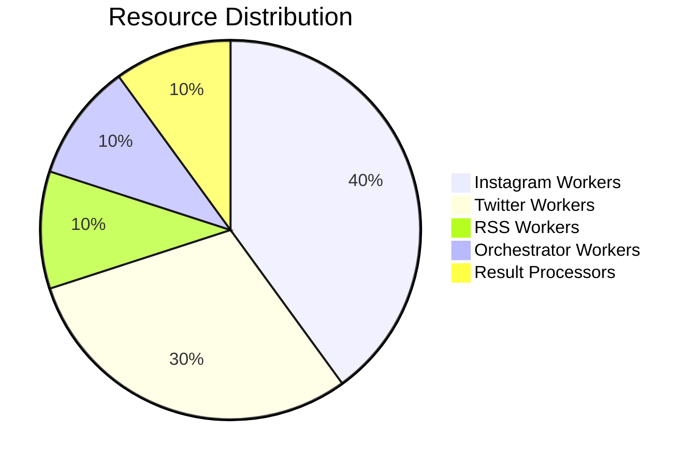

# Source Fetching Orchestrator Flow

## Overview

The Source Fetching Orchestrator Flow is a multi-layered job processing architecture that efficiently routes and processes source fetching jobs through specialized queues. This design separates concerns into distinct layers: job creation, orchestration, collection, and result processing.

### Key Principles

1. **Separation of Concerns**: Each layer has a single, well-defined responsibility
2. **Unified Entry Point**: All jobs enter through a single orchestrator queue
3. **Specialized Processing**: Each source type has its own collector queue with optimized settings
4. **Unified Results**: All results are processed through a single results queue
5. **Scalability**: Each layer can scale independently based on workload

---

## System Architecture



---

## Queue Structure

### 1. Orchestrator Queue (Entry Point)

**Queue Name**: `source-fetcher-orchestrator`

**Purpose**: Single entry point for all source fetching jobs

**Configuration**:

- **Concurrency**: 10 (can route jobs quickly)
- **Rate Limit**: None (internal routing, no external API calls)
- **Priority**: Inherited from Priority Calculator
- **Retries**: 3 attempts with exponential backoff
- **Job Retention**: Last 100 completed, last 1000 failed

**Job Data Structure**:

```typescript
{
  sourceId: string;           // Database source ID
  priority: number;          // 1-10 (1 = highest)
  scheduledBy: 'cron' | 'user' | 'webhook';
  metadata?: {
    userId?: string;         // If triggered by user action
    triggerReason?: string;  // Why this job was created
  }
}
```

### 2. Collector Queues (Per Source Type)

#### Instagram Queue

**Queue Name**: `instagram-fetcher`

**Configuration**:

- **Concurrency**: 5 (respect Instagram rate limits)
- **Rate Limit**: 10 jobs per minute
- **Priority**: Inherited from orchestrator job
- **Retries**: 3 attempts with exponential backoff
- **Job Timeout**: 5 minutes

#### Twitter Queue

**Queue Name**: `twitter-fetcher`

**Configuration**:

- **Concurrency**: 3 (respect Twitter rate limits)
- **Rate Limit**: 15 jobs per minute
- **Priority**: Inherited from orchestrator job
- **Retries**: 3 attempts with exponential backoff
- **Job Timeout**: 5 minutes

#### RSS Queue

**Queue Name**: `rss-fetcher`

**Configuration**:

- **Concurrency**: 10 (RSS is fast, no rate limits)
- **Rate Limit**: 100 jobs per minute
- **Priority**: Inherited from orchestrator job
- **Retries**: 2 attempts with linear backoff
- **Job Timeout**: 2 minutes

**Job Data Structure** (after enrichment by Orchestrator):

```typescript
{
  sourceId: string;
  sourceType: 'instagram' | 'twitter' | 'rss';
  externalId: string;        // Username, handle, or URL
  cursor?: string;           // Pagination cursor
  limit?: number;            // Max posts to fetch
  priority: number;          // Inherited from orchestrator
  metadata: {
    orchestratorJobId: string;
    scheduledAt: Date;
    sourceMetadata: {
      lastFetchedAt?: Date;
      lastCursor?: string;
      fetchConfig?: any;
    };
  };
}
```

### 3. Results Queue (Unified Output)

**Queue Name**: `fetch-results`

**Purpose**: Single queue for all fetch results from all collectors

**Configuration**:

- **Concurrency**: 20 (can process results quickly)
- **Rate Limit**: None (internal processing)
- **Priority**: Based on source priority
- **Retries**: 5 attempts (critical to store results)
- **Job Timeout**: 1 minute

**Job Data Structure**:

```typescript
{
  sourceId: string;
  sourceType: 'instagram' | 'twitter' | 'rss';
  status: 'success' | 'error';
  posts?: Post[];            // Fetched posts
  nextCursor?: string;       // For pagination
  error?: {
    code: string;
    message: string;
    retryable: boolean;
  };
  processingTime: number;    // Milliseconds
  metadata: {
    collectorJobId: string;
    orchestratorJobId: string;
    fetchedAt: Date;
  };
}
```

---

## Detailed Flow

### Step 1: Job Creation (Priority Calculator)

**What happens:**
Every 5 minutes, the Priority Calculator analyzes all sources and creates jobs in the orchestrator queue.



**Priority Calculation**:

- **100+ followers**: Priority 1, Fetch every 3 minutes
- **50-99 followers**: Priority 2, Fetch every 5 minutes
- **20-49 followers**: Priority 3, Fetch every 10 minutes
- **10-19 followers**: Priority 4, Fetch every 15 minutes
- **5-9 followers**: Priority 5, Fetch every 30 minutes
- **2-4 followers**: Priority 6, Fetch every 1 hour
- **1 follower**: Priority 7, Fetch every 2 hours
- **0 followers**: No job created (paused)

### Step 2: Orchestration (Orchestrator Processor)

**What happens:**
The Orchestrator Processor consumes jobs from the orchestrator queue, enriches them with source metadata, and routes them to the appropriate collector queue.



**Orchestrator Responsibilities**:

1. **Job Enrichment**:
   - Load source metadata from database
   - Add pagination cursor (if exists)
   - Add fetch parameters (limit, timeout)
   - Add source-specific configuration

2. **Job Routing**:
   - Determine source type
   - Route to appropriate collector queue
   - Preserve priority from orchestrator job

3. **Validation**:
   - Validate source exists and is active
   - Check if source should be skipped (paused, error state)
   - Validate job data structure

4. **Flow Control**:
   - Can batch multiple sources of same type
   - Can throttle high-priority sources
   - Can add delays for rate limiting

### Step 3: Collection (Collector Workers)

**What happens:**
Workers consume jobs from their specific collector queue, fetch posts from external APIs/scrapers, and create result jobs in the unified results queue.



**Worker Types**:

1. **Python Workers** (Instagram, Twitter):
   - Connect to Redis directly using `bullmq` Python library
   - Consume from collector queue
   - Call external scrapers/APIs
   - Post results to unified results queue

2. **NestJS Workers** (RSS, can also be Instagram/Twitter):
   - Use `@Processor` decorator
   - Can run in same process or separate microservice
   - Type-safe job data
   - Share code with result processor

**Worker Responsibilities**:

1. **Fetch Execution**:
   - Call external API/scraper
   - Handle pagination (use cursor if provided)
   - Respect rate limits
   - Handle timeouts

2. **Data Transformation**:
   - Convert platform-specific format to standard Post format
   - Extract metadata (likes, comments, etc.)
   - Handle media URLs

3. **Result Creation**:
   - Create result job in unified results queue
   - Include all necessary metadata
   - Mark collector job as complete

### Step 4: Result Processing (Result Processor)

**What happens:**
The Result Processor consumes jobs from the unified results queue, stores posts in the database, updates cache, and updates source metadata.



**Result Processor Responsibilities**:

1. **Post Storage**:
   - Deduplicate posts (check by externalId)
   - Bulk insert new posts
   - Handle database errors

2. **Cache Management**:
   - Update Redis cache with new posts
   - Set appropriate TTL (5 minutes)
   - Invalidate old cache entries

3. **Metadata Updates**:
   - Update source.lastFetchedAt
   - Update source.cursor (for pagination)
   - Update source.lastFetchSuccess
   - Update source.lastError (if failed)

4. **Error Handling**:
   - Classify errors (retryable vs permanent)
   - Update source error state
   - Schedule retries for retryable errors
   - Pause source for permanent errors

---

## Complete Flow Example

### Scenario: User follows NASA Instagram account



---

## Job Chaining with Flow Producer

BullMQ Flow Producer allows chaining jobs together, creating a traceable job chain:



**Benefits**:

- **Traceability**: Can track job from creation to completion
- **Dependencies**: Result job depends on collector job
- **Error Propagation**: Errors bubble up through chain
- **Monitoring**: Can see where in chain job failed

**Implementation**:

```typescript
// Orchestrator creates collector job with parent reference
const collectorJob = await collectorQueue.add('fetch', data, {
  parent: { id: orchestratorJob.id, queue: 'source-fetcher-orchestrator' },
});

// Collector creates result job with parent reference
const resultJob = await resultsQueue.add('process', resultData, {
  parent: { id: collectorJob.id, queue: 'instagram-fetcher' },
});
```

---

## Error Handling Strategy

### Error Categories

| Error Type           | Layer            | Retry Strategy             | Action                    |
| -------------------- | ---------------- | -------------------------- | ------------------------- |
| **Routing Error**    | Orchestrator     | Retry 3 times              | Log and alert             |
| **Source Not Found** | Orchestrator     | Don't retry                | Pause source              |
| **Network Timeout**  | Collector        | Retry 3 times with backoff | Continue                  |
| **Rate Limit**       | Collector        | Retry after delay          | Respect rate limit        |
| **Auth Error**       | Collector        | Don't retry                | Pause source, alert admin |
| **Storage Error**    | Result Processor | Retry 5 times              | Critical, must store      |
| **Cache Error**      | Result Processor | Retry 2 times              | Non-critical, log         |

### Error Flow



---

## Monitoring & Observability

### Key Metrics

**Orchestrator Queue**:

- Jobs created per minute
- Routing decisions (per source type)
- Enrichment time (p50, p95, p99)
- Routing errors

**Collector Queues**:

- Jobs processed per minute
- Fetch success rate
- Average fetch time
- Rate limit hits
- Worker availability

**Results Queue**:

- Results processed per minute
- Storage success rate
- Cache hit rate
- Average processing time
- Duplicate post rate

### Monitoring Points



### BullMQ Dashboard

Access BullMQ dashboard to monitor:

- Queue sizes (waiting, active, completed, failed)
- Job progress
- Worker status
- Job history
- Error logs

---

## Scalability Considerations

### Horizontal Scaling

**Orchestrator Workers**:

- Can run multiple orchestrator processors
- Each consumes from same orchestrator queue
- No conflicts (BullMQ handles distribution)

**Collector Workers**:

- Scale Instagram workers independently
- Scale Twitter workers independently
- Scale RSS workers independently
- Each queue scales based on workload

**Result Processors**:

- Can run multiple result processors
- All consume from unified results queue
- Process results in parallel

### Vertical Scaling

**Queue Configuration**:

- Adjust concurrency per queue type
- Adjust rate limits based on external API limits
- Adjust retry strategies based on error patterns

### Resource Allocation



---

## Benefits Summary

### 1. **Separation of Concerns**

- Each layer has single responsibility
- Easy to understand and maintain
- Changes in one layer don't affect others

### 2. **Scalability**

- Scale each layer independently
- Add workers without code changes
- Optimize each queue type separately

### 3. **Reliability**

- Retries at each layer
- Dead letter queues for debugging
- Error handling per layer

### 4. **Observability**

- Clear job flow
- Easy to identify bottlenecks
- Track performance per layer

### 5. **Flexibility**

- Easy to add new source types
- Can swap worker implementations
- Can add preprocessing/postprocessing

### 6. **Testability**

- Mock orchestrator to test collectors
- Test each layer independently
- Easy to write unit tests

---

## Implementation Checklist

### Phase 1: Core Infrastructure

- [ ] Set up BullMQ queues (orchestrator, collectors, results)
- [ ] Implement Priority Calculator
- [ ] Implement Orchestrator Processor
- [ ] Implement Result Processor

### Phase 2: Collector Workers

- [ ] Implement Instagram Worker (Python or NestJS)
- [ ] Implement Twitter Worker (Python or NestJS)
- [ ] Implement RSS Worker (NestJS)

### Phase 3: Advanced Features

- [ ] Implement Flow Producer for job chaining
- [ ] Add rate limiting per queue
- [ ] Add monitoring and metrics
- [ ] Add dead letter queues

### Phase 4: Optimization

- [ ] Tune concurrency per queue
- [ ] Optimize retry strategies
- [ ] Add batching for high-volume sources
- [ ] Implement caching strategies

---

## Next Steps

1. **Implementation**: Start with orchestrator processor and basic collectors
2. **Testing**: Test each layer independently
3. **Monitoring**: Set up metrics and dashboards
4. **Optimization**: Tune based on real-world usage
5. **Scaling**: Add workers as needed based on load
