# Source Fetching System

## Overview

The Source Fetching System is an intelligent content aggregation architecture that efficiently collects posts from various social media platforms (Instagram, Twitter, RSS feeds) and delivers them to users in real-time.

### Key Principles

1. **Efficiency First**: Fetch each source only once, regardless of how many users follow it
2. **Smart Prioritization**: Popular sources are updated more frequently than unpopular ones
3. **Resource Optimization**: Inactive sources are not fetched, saving computing resources
4. **Real-time Delivery**: Users see fresh content within minutes of it being posted
5. **Reliability**: Failed fetches are automatically retried without user intervention

---

## System Architecture


---

## Business Flow

### 1. Source Discovery & Prioritization

**What happens:**
Every 5 minutes, the system analyzes all sources and determines which ones need to be fetched.

**Decision Logic:**


**Active User Definition:**
A user is considered "active" if they have logged in or viewed their feed within the last 24 hours.

---

### 2. Content Fetching Process

**What happens:**
When it's time to fetch a source, the system retrieves the latest posts and stores them.


**Deduplication Logic:**
- Each post has a unique external ID (e.g., Instagram post ID)
- Before storing, check if post already exists
- Only store new posts to avoid duplicates
- Update cursor to remember where we stopped

---

### 3. Smart Caching Strategy

**What happens:**
Recently fetched posts are stored in a fast cache to provide instant access to users.


**Cache Benefits:**
- **Speed**: Cache responses are 10-100x faster than database queries
- **Reduced Load**: Popular sources read from cache by many users
- **Fresh Data**: 5-minute TTL ensures data doesn't get too stale
- **Fallback**: If cache fails, database is always available

---

### 4. Error Handling & Reliability

**What happens when something goes wrong:**

```mermaid
flowchart TD
    START([Fetch Job Starts]) --> ATTEMPT1[Attempt 1:<br/>Try to fetch posts]
    
    ATTEMPT1 --> CHECK1{Success?}
    CHECK1 -->|Yes ✓| STORE[Store posts<br/>Update cache]
    CHECK1 -->|No ✗| ERROR1[Error occurred]
    
    ERROR1 --> CLASSIFY{Error Type?}
    
    CLASSIFY -->|Network timeout<br/>Rate limit<br/>Temporary issue| RETRY1[Wait 5 seconds]
    CLASSIFY -->|Invalid credentials<br/>Account suspended<br/>Permanent issue| ALERT[Alert administrators]
    
    RETRY1 --> ATTEMPT2[Attempt 2:<br/>Try again]
    ATTEMPT2 --> CHECK2{Success?}
    CHECK2 -->|Yes ✓| STORE
    CHECK2 -->|No ✗| WAIT2[Wait 15 seconds]
    
    WAIT2 --> ATTEMPT3[Attempt 3:<br/>Final attempt]
    ATTEMPT3 --> CHECK3{Success?}
    CHECK3 -->|Yes ✓| STORE
    CHECK3 -->|No ✗| FAIL[Mark as failed<br/>Send to Dead Letter Queue]
    
    STORE --> SCHEDULE[Schedule next fetch]
    ALERT --> MANUAL[Manual investigation required]
    FAIL --> MANUAL
    
    SCHEDULE --> END([Complete])
    MANUAL --> END

    style STORE fill:#a8e6cf
    style ALERT fill:#ff6b6b
    style FAIL fill:#ff9f43
    style RETRY1 fill:#ffd93d
    style WAIT2 fill:#ffd93d
```



**Error Categories:**

| Error Type | Retryable? | Action |
|------------|------------|--------|
| Network timeout | ✅ Yes | Retry with exponential backoff |
| Rate limit exceeded | ✅ Yes | Wait and retry after specified time |
| Authentication failed | ❌ No | Alert admin, pause source |
| Account not found | ❌ No | Mark source as invalid |
| Private account | ❌ No | Notify user, pause fetching |
| Server error (5xx) | ✅ Yes | Retry up to 3 times |

---

## User-Facing Scenarios

### Scenario 1: New User Follows Popular Source


**Key Points:**
- User sees existing posts immediately (from cache)
- No additional fetch triggered (NASA already on schedule)
- New posts appear within 3 minutes
- Cost: 1 fetch serves 100+ users

---

### Scenario 2: New User Follows Niche Source


**Key Points:**
- First fetch happens within 5 minutes of following
- Subsequent fetches every 2 hours (low priority)
- If user stops viewing feed, priority drops further
- If user unfollows, fetching stops completely

---

### Scenario 3: Source Gains Popularity


**Automatic Adaptation:**
The system automatically adjusts fetch frequency as popularity changes, without any manual intervention.

---

## Business Benefits

### 1. Cost Efficiency

**Traditional Approach:**
```
100 users follow NASA
Each user requests feed every 5 minutes
= 100 fetches × 12 times/hour = 1,200 fetches/hour
```

**Our Approach:**
```
100 users follow NASA
System fetches NASA once every 3 minutes
= 1 fetch × 20 times/hour = 20 fetches/hour
```

**Savings: 98.3% reduction in API calls**

### 2. Resource Allocation


**Smart Resource Allocation:**
- 70% of resources go to sources that serve the most users
- 0% wasted on sources nobody follows
- Automatic rebalancing as user behavior changes

### 3. User Experience

| Metric | Value | Notes |
|--------|-------|-------|
| **Average Feed Load Time** | < 100ms | Thanks to caching |
| **Content Freshness** | 3-120 min | Based on source popularity |
| **Feed Availability** | 99.9% | Multiple retry mechanisms |
| **New Post Delay** | 3-120 min | Popular sources update fastest |

### 4. Scalability


**Why Sub-Linear Scaling?**
- Multiple users share the same sources
- Popular sources (most users) are fetched once
- Only unique niche sources add fetch cost

---

## Operational Metrics

### Key Performance Indicators


**Target Values:**
- Fetch Deduplication Rate: > 80%
- Cache Hit Rate: > 90%
- Fetch Success Rate: > 98%
- Average Post Freshness: < 10 minutes (popular sources)
- Feed Load Time: < 200ms
- API Cost per User: < $0.01/month

---

## Priority Adjustment Examples

### Real-World Example: Daily Patterns


**Adaptive Behavior:**
- System detects user activity patterns
- Adjusts fetch frequency throughout the day
- Saves resources during low-activity periods
- Ensures freshness during peak hours

---

## Failure Recovery Example

### Real Scenario: Instagram API Rate Limit


**Self-Healing:**
- Automatic retry with appropriate delays
- No user impact (cache serves stale data)
- Administrator alerted only if issue persists
- System learns optimal retry timing

---

## Summary

The Source Fetching System is designed to:

✅ **Maximize Efficiency**: One fetch serves many users  
✅ **Optimize Resources**: Focus on popular sources  
✅ **Ensure Freshness**: Frequent updates for active sources  
✅ **Guarantee Reliability**: Automatic error recovery  
✅ **Scale Effortlessly**: Sub-linear growth with user base  
✅ **Minimize Costs**: Reduced external API calls  
✅ **Deliver Speed**: Cache-first architecture  

### Business Value Proposition

| Traditional Approach | Our System | Improvement |
|---------------------|------------|-------------|
| Fetch on every user request | Shared, scheduled fetching | **98% fewer API calls** |
| Fixed update frequency | Dynamic prioritization | **Better resource usage** |
| User waits for fetch | Instant from cache | **10-100x faster** |
| Manual scaling needed | Auto-adjusts to demand | **Zero-touch scaling** |
| No deduplication | Smart deduplication | **Sub-linear cost growth** |

---

## Next Steps

1. **Monitoring Dashboard**: View real-time fetch status and metrics
2. **Admin Panel**: Manually trigger fetches or adjust priorities
3. **User Settings**: Let users boost priority for favorite sources
4. **Analytics**: Track which sources drive most engagement
5. **Cost Optimization**: Identify expensive sources and optimize fetch strategy

